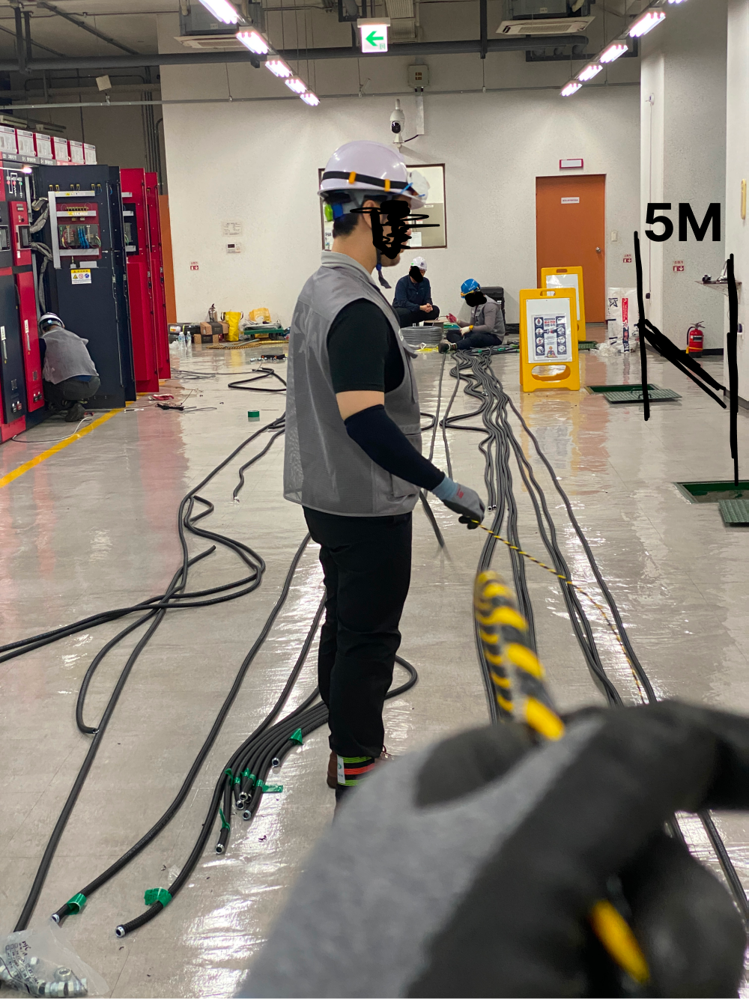
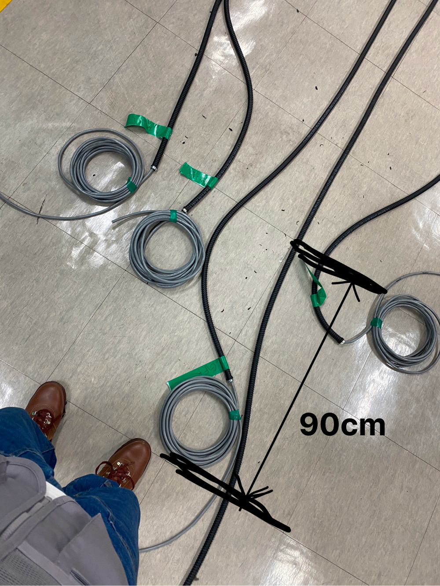
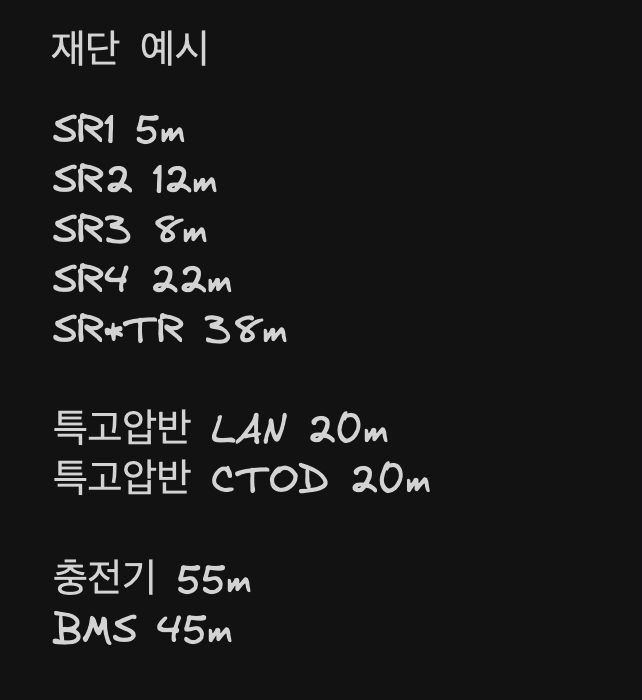
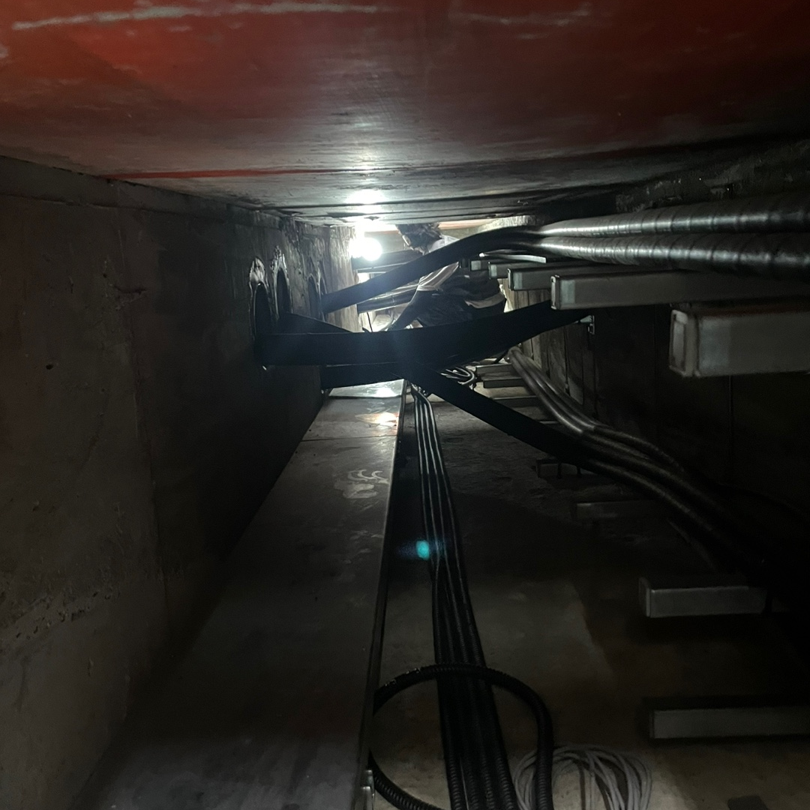
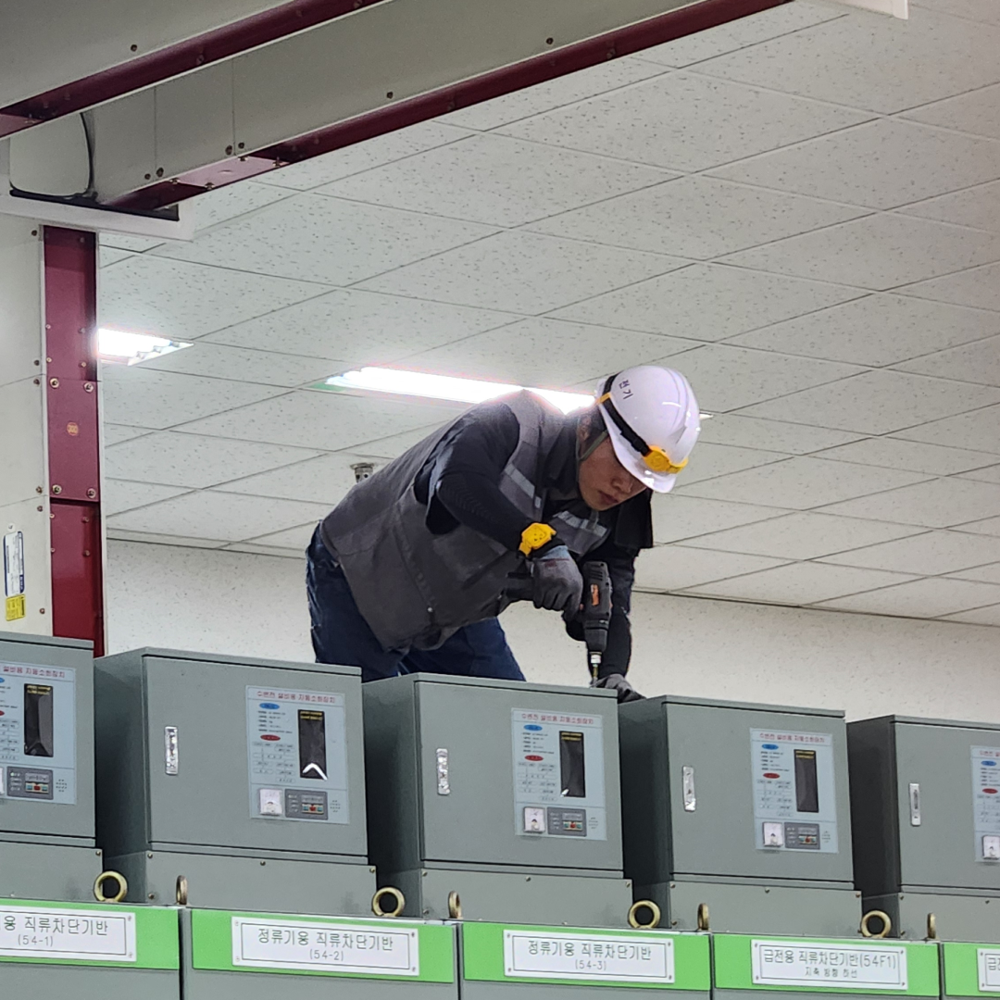

## 전기조공

<br>

현재 단기로 지인의 전기공사 팀에 들어가서 전기조공 일을 진행하고 있다. 업무는 변전소 내의 기기들의 연결 및 대기실까지 사용할 전기선들을 재단하고 포설하는 일이다.
일을 하면서 느낀 불편한 점이 있는데 정말 간단하지만 문제를 정의하고 해결해 보는 기록을 해보려고 한다.

## 후렉시블 길이 정확하게 측정하기

<br>


## 1. 문제 상황

<br>

전기 작업 시 각 기기에 필요한 선들을 재단하는 게 첫 시작이다. 필요한 길이의 후렉시블을 만들고 그 안에 LAN 선이나 485선을 알맞게 넣어서 사용하게 된다.

예시처럼 후렉시블 길이가 필요하다고 할 때 미터 수치를 최대한 오차 없이 재단해야 무리 없이 진행이 된다. 이게 잘못되면 시간은 시간대로 재료 비용은 비용대로 손해가 발생한다.
문제점은 이 길이를 재는 방법인데 보통 변전소 내의 기둥과 기둥 사이로 가늠하거나 타일의 길이로 가늠하게 된다.

<br>




<br>

위 사진처럼 가늠 잡고 계산하기 때문에 아무래도 부정확할 수 있는 확률이 존재한다. 더군다나 현장 일 특성상 여유가 많지 않기에 바쁜 상황에 줄 길이 계산한다고 왔다 갔다 얼타고 있다간 소장님이나 사장님의 사자후가 날라오는데 몇 십 개가 깔린 선들과 널브러진 공구들 사이에서 머리가 하얘질 수 있다. 긴장해서 되는 일도 더 안되기 때문에 부정적인 스노우볼은 애초에 막아야 한다.

물론 재단할 때 길이가 부족하지 않도록 약간의 여유를 더 주고 계산하기에 크게 잘못될 일은 흔치 않지만(?) **딱 맞는 계산이 필요할 땐 문제가 많이 발생한다.**
후렉시블 1 묶음은 총 50m다. 만약 35m 15m 제단이 필요하다면 1 묶음으로 끝나는데 1m라도 오차가 발생하면 다시 또 새로운 50m 묶음을 잘라내야 한다. 한 현장에 10 - 20개 사이의 선들을 재단하는데 이런 식으로 한 번 밀리게 되면 자재비용, 작업시간 계속 손해를 보게 된다.

<br>



<br>

**예시 사진처럼 총 요구되는 길이를 확인하고 그날 가져온 50m 묶음의 개수로 어떻게 최대한 로스 없이 사용해놓느냐가 포인트이기에 후렉시블 계산이 중요하다고 판단됐다.**

## 2. 문제점 분석

<br>

부정확한 길이 측정의 근본적 원인은 육안적으로 대략 길이를 판단하는 기준 때문이다. 정확한 계산을 할 수 있도록 기준을 잡고 계산할 수 있게 해보자.

## 3. 해결책

<br>

변전소들의 생김새는 비슷하지만 크기나 길이 전공구의 모양들이 전부 다르다. 설계할 때 기둥과 기둥 사이는 5M 타일의 길이는 한 칸에 45cm로 만들었다고 하는데 기둥은 변전소마다 약간의 오차가 있다는 걸 확인했고 가장 확실했던 타일의 길이를 기준으로 잡았다. 타일의 길이는 한 칸에 45cm라서 두 칸에 90cm를 1M로 어림잡고 이동하며 길이를 재는데 **10cm씩 값이 빠지기 때문에 나머지 값을 다시 계산해 줘야 정확하다. 이 부분에서 로스가 많이 발생할 확률이 높기 때문에** m를 입력하면 정확한 칸 수치를 보여주는 계산기를 만들어 본다.

## 4. 구현 과정

<br>

```JS
const calculate = document.querySelector('.calculate');
const input = document.querySelector('.input');
const result = document.querySelector('.result');

calculate.addEventListener('click', () => {
  const inputValue = parseFloat(input.value);

  if (isNaN(inputValue) || inputValue <= 0) {
    result.textContent = '올바른 숫자를 입력하세요';
    return;
  }

  const lengthInCm = inputValue * 100;
  const stepLength = 90;
  const fullSteps = Math.floor(lengthInCm / stepLength);
  const remainingCm = lengthInCm % stepLength;
  const additionalSteps = (remainingCm / stepLength).toFixed(1);
  const totalSteps = (fullSteps + parseFloat(additionalSteps)).toFixed(1);

  result.textContent = `${lengthInCm}cm 입니다. ${totalSteps}칸을 가야 합니다.`;
});
```

## 5. 결과 및 개선사항

<br>


이 계산기를 사용하면 재단할 때 바로바로 정확한 길이를 체크할 수 있으니 불편함을 해결할 수 있다. 재단할 때 켜놓고 사용해야겠다. 다만 변전소의 타일이 다를 경우 다시 측정해야 될 수도 있지만 기지가 아니라 변전소는 고정이라 큰 문제는 없어 보인다. 사실 뭐 없는 정말 간단한 코드이긴 한데 😂 나한테는 필요한 것이어서 시도해 봤다. 잘 사용해 보자

---

<br>

최근에 작업한 현장 관련 사고가 뉴스에 나오는데 기분이 이상하다. 잘 마무리하고 마칠 수 있도록 긴장 놓지 말고 잘 해보자.

<br>



